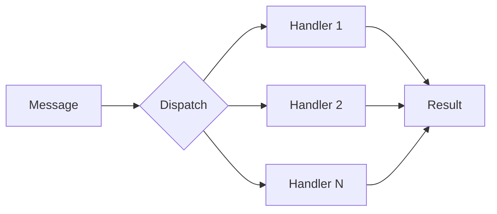

# Building the PDF Report

This folder contains source files for generating beautiful PDF documentation.

## Option 1: Typst (Recommended)

**Typst** is a modern typesetting system that produces beautiful PDFs with a clean, readable syntax.

### Installation

```bash
# Windows (winget)
winget install typst

# macOS (Homebrew)
brew install typst

# Linux (Cargo)
cargo install typst-cli

# Or download from: https://typst.app/
```

### Generate PDF

```bash
cd docs/pdf
typst compile chopsticks-performance-report.typ
```

This produces `chopsticks-performance-report.pdf` with:
- Professional cover page with gradient background
- Automatic table of contents
- Syntax-highlighted code blocks
- Custom info/warning/success boxes
- Beautiful metric cards
- Glossary and appendix
- Back cover

### Live Preview

```bash
typst watch chopsticks-performance-report.typ
```

Opens a live preview that updates as you edit.

### Customization

Edit the configuration section at the top of the `.typ` file to change:
- Colors (brand colors in `rgb("#...")` format)
- Fonts (requires fonts installed on system)
- Page size and margins
- Header/footer content

---

## Option 2: Pandoc + Eisvogel Template

**Pandoc** converts Markdown to PDF using LaTeX. The **Eisvogel** template produces beautiful reports.

### Installation

```bash
# Install Pandoc
winget install pandoc
# OR: https://pandoc.org/installing.html

# Install LaTeX (required for PDF output)
# Windows: Install MiKTeX from https://miktex.org/
# macOS: brew install --cask mactex
# Linux: sudo apt install texlive-full

# Install Eisvogel template
# Download from: https://github.com/Wandmalfarbe/pandoc-latex-template
# Place eisvogel.latex in:
#   Windows: %APPDATA%\pandoc\templates\
#   macOS/Linux: ~/.pandoc/templates/
```

### Generate PDF

```bash
cd docs/pdf
pandoc chopsticks-performance-report-pandoc.md \
  -o chopsticks-performance-report.pdf \
  --from markdown \
  --template eisvogel \
  --listings \
  --toc \
  --number-sections \
  -V colorlinks=true
```

### Quick Version (No Template)

If you don't want to install Eisvogel:

```bash
pandoc chopsticks-performance-report-pandoc.md \
  -o chopsticks-performance-report.pdf \
  --toc \
  --number-sections \
  -V geometry:margin=1in
```

---

## Option 3: VS Code Extension

Install the **Markdown PDF** extension in VS Code:

1. Install extension: `yzane.markdown-pdf`
2. Open `PERFORMANCE-OPTIMIZATION-GUIDE.md`
3. Press `Ctrl+Shift+P` → "Markdown PDF: Export (pdf)"

Less control over styling, but quick and easy.

---

## Option 4: Online Converters

For quick one-off generation:

- **Typst.app** — Paste Typst code, export PDF
- **Overleaf** — Online LaTeX editor
- **CloudConvert** — Upload Markdown, download PDF

---

## Recommended Fonts

For best results, install these fonts:

| Font | Use | Download |
|------|-----|----------|
| Inter | Body text | https://rsms.me/inter/ |
| JetBrains Mono | Code | https://www.jetbrains.com/lp/mono/ |
| Fira Sans | Headings (alt) | https://fonts.google.com/specimen/Fira+Sans |

---

## Adding Graphics

### Mermaid Diagrams

You can add architecture diagrams using Mermaid. Create a `.mmd` file:



Convert to SVG/PNG:
```bash
npx @mermaid-js/mermaid-cli -i diagram.mmd -o diagram.svg
```

Then include in your document.

### Performance Charts

Use a tool like:
- **Plotly** — Interactive charts exportable to PNG
- **Matplotlib** — Python charting
- **Excel/Google Sheets** — Export charts as images

---

## File Structure

```
docs/pdf/
├── BUILD-PDF.md                           # This file
├── chopsticks-performance-report.typ      # Typst source (recommended)
├── chopsticks-performance-report-pandoc.md # Pandoc/Markdown source
├── graphics/                              # Images and diagrams
│   ├── architecture-before.svg
│   ├── architecture-after.svg
│   ├── benchmark-chart.png
│   └── logo.png
└── output/                                # Generated PDFs go here
    └── chopsticks-performance-report.pdf
```

---

## Troubleshooting

### Typst: "Font not found"

Install the required fonts or change the font in the document:
```typst
#set text(font: "Arial")  // Use a system font
```

### Pandoc: "pdflatex not found"

Install a LaTeX distribution (MiKTeX, TeX Live, or MacTeX).

### Code blocks look wrong

Ensure `--listings` flag is used with Pandoc, or use the `code-block-font-size` option.

---

## Quality Checklist

Before distributing:

- [ ] Cover page looks professional
- [ ] Table of contents is accurate
- [ ] Code blocks are syntax-highlighted
- [ ] Tables fit within page margins
- [ ] Page numbers are correct
- [ ] All links work (for digital distribution)
- [ ] No orphaned headings at page breaks
- [ ] Fonts render correctly
