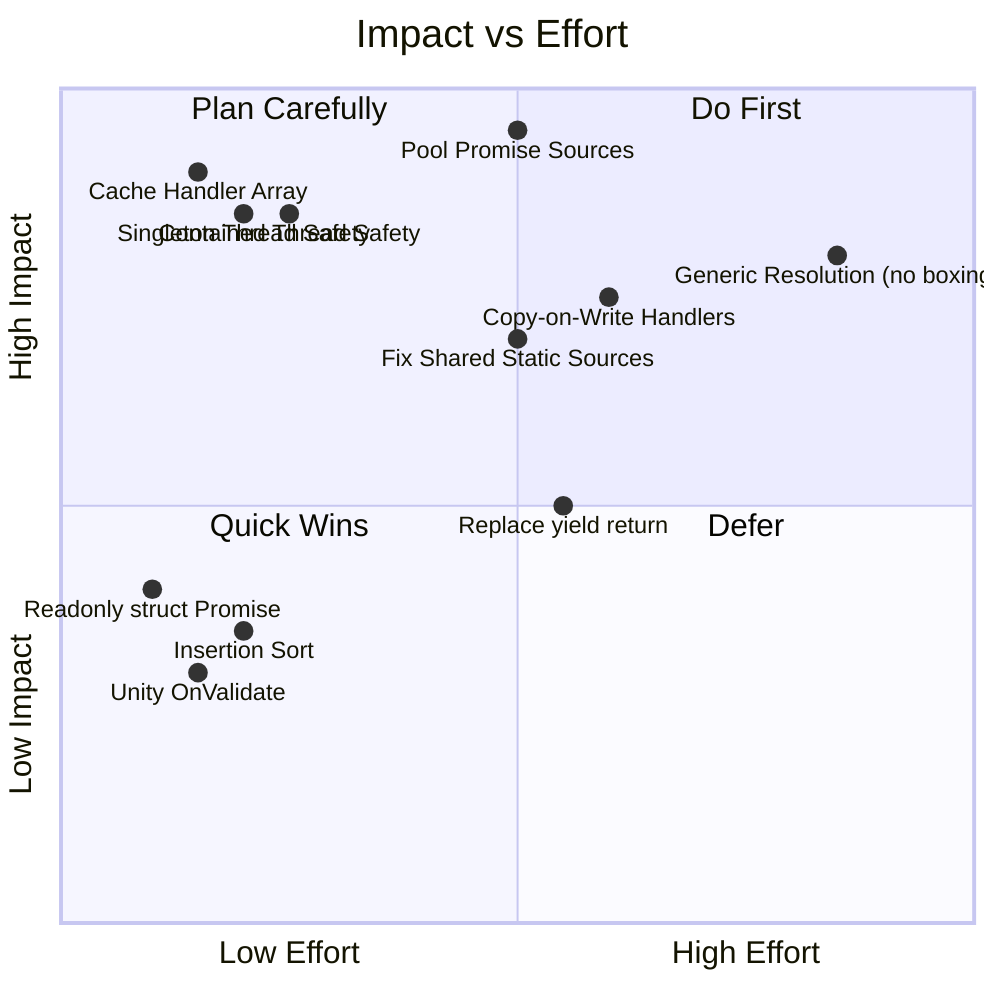
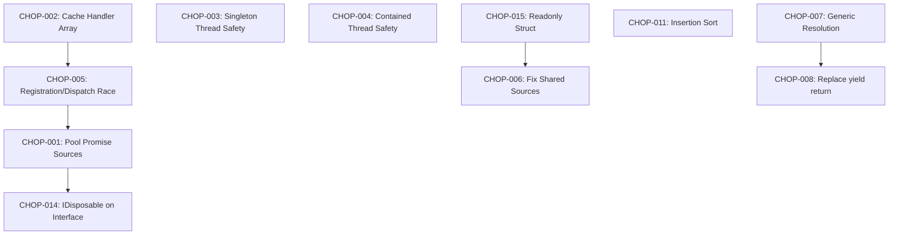

# 🎯 Master Tracking: Chopsticks Performance Optimization Sprint

## Overview

This document tracks all identified performance issues in the Chopsticks framework, prioritized by impact and effort. These issues were identified through a comprehensive code audit covering all 116 C# source files across the Native layer (Dependencies, Foundation, Messages) and Unity integration packages.

## Priority Matrix

## Ticket Index

### 🔴 P0 — Critical (Ship-Blocking)

| Ticket | Title | Status |
|--------|-------|--------|
| [CHOP-001](./001-pool-promise-sources.md) | Pool SequentialHandlingPromiseSource to eliminate GC pressure | ⬜ TODO |
| [CHOP-002](./002-cache-handler-array.md) | Cache RegisteredMessageHandlers array (copy-on-write) | ⬜ TODO |
| [CHOP-003](./003-singleton-thread-safety.md) | Thread-safe SingletonResolution.Get() | ⬜ TODO |
| [CHOP-004](./004-contained-thread-safety.md) | Thread-safe ContainedResolution.Get() | ⬜ TODO |
| [CHOP-005](./005-registration-dispatch-race.md) | Fix race condition: handler registration vs dispatch | ⬜ TODO |
| [CHOP-006](./006-shared-static-sources.md) | Fix shared mutable state in HandlingResultPromise static sources | ⬜ TODO |

### 🟠 P1 — Major Performance

| Ticket | Title | Status |
|--------|-------|--------|
| [CHOP-007](./007-generic-resolution-no-boxing.md) | Generic DependencyResolution<T> to eliminate boxing | ⬜ TODO |
| [CHOP-008](./008-replace-yield-return.md) | Replace yield return with concrete collections | ⬜ TODO |
| [CHOP-009](./009-lambda-closure-allocations.md) | Eliminate lambda closure allocations in registration extensions | ⬜ TODO |
| [CHOP-010](./010-deregister-double-lookup.md) | Fix double dictionary lookup in Deregister | ⬜ TODO |
| [CHOP-011](./011-sort-on-registration.md) | Replace full Sort with insertion-point binary search | ⬜ TODO |
| [CHOP-012](./012-merge-exceptions-quadratic.md) | Fix O(N²) allocation in MergeExceptions | ⬜ TODO |

### 🟡 P2 — Moderate

| Ticket | Title | Status |
|--------|-------|--------|
| [CHOP-013](./013-unity-onvalidate-perf.md) | Cache OnValidate parent hierarchy lookups | ⬜ TODO |
| [CHOP-014](./014-idisposable-promise-source.md) | Add IDisposable to IHandlingPromiseSource interface | ⬜ TODO |
| [CHOP-015](./015-readonly-struct-promise.md) | Make HandlingResultPromise a readonly struct | ⬜ TODO |
| [CHOP-016](./016-mono-dependent-cleanup.md) | Add OnDestroy cleanup to BaseMonoDependent | ⬜ TODO |
| [CHOP-017](./017-handling-result-static-fields.md) | Convert HandlingResult static properties to static readonly fields | ⬜ TODO |

### 🟢 P3 — Minor/Style

| Ticket | Title | Status |
|--------|-------|--------|
| [CHOP-018](./018-remove-handle-promise-source.md) | Remove redundant HandlePromiseSource wrapper | ⬜ TODO |
| [CHOP-019](./019-remove-empty-foundation.md) | Remove empty Foundation project | ⬜ TODO |
| [CHOP-020](./020-xml-documentation-consistency.md) | Standardize XML documentation across public APIs | ⬜ TODO |

## Dependency Graph

## Success Metrics

After all optimizations are implemented:
- **Zero heap allocations** per message dispatch in the steady-state hot path
- **Thread-safe** singleton and contained resolution without lock contention
- **Zero race conditions** in handler registration during dispatch
- **< 1μs** per dependency resolution for cached singletons
- **No GC spikes** observable in Unity Profiler during message-heavy frames
